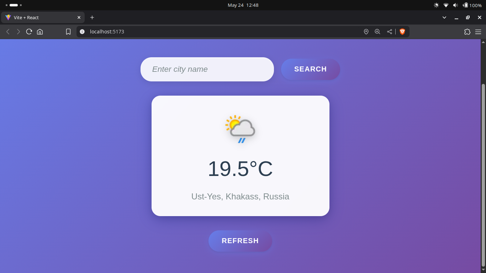

# 🌦️ Weather App

A sleek and responsive Weather App built with modern web technologies. Instantly fetch current weather data for any city around the globe. Powered by a clean UI and live weather API.

🔗 **Live Demo:** [weather-app-chi-eight-86.vercel.app](https://weather-app-chi-eight-86.vercel.app/)

## 🚀 Features

- 🌍 Search weather by city name
- ☁️ Weather descriptions with intuitive icons


## 🛠️ Tech Stack

- **Frontend:** HTML, CSS, JavaScript, React
- **API:** Weatherapi[dot]com
- **Hosting:** [Vercel](https://vercel.com)

## 📸 Preview

 <!-- Optional: add your screenshot image here -->

## 📦 Getting Started

1. **Clone the repository**
   ```bash
   git clone https://github.com/piyushh7274/WeatherApp.git
   cd WeatherApp

